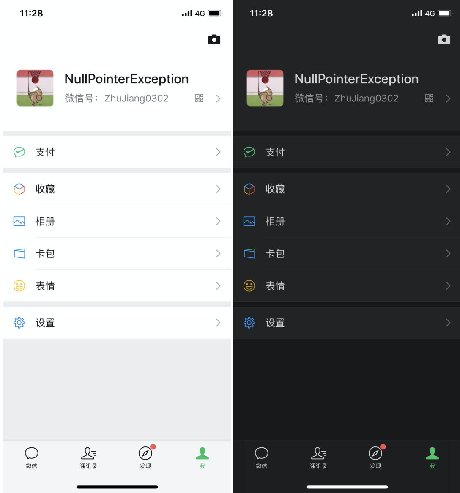
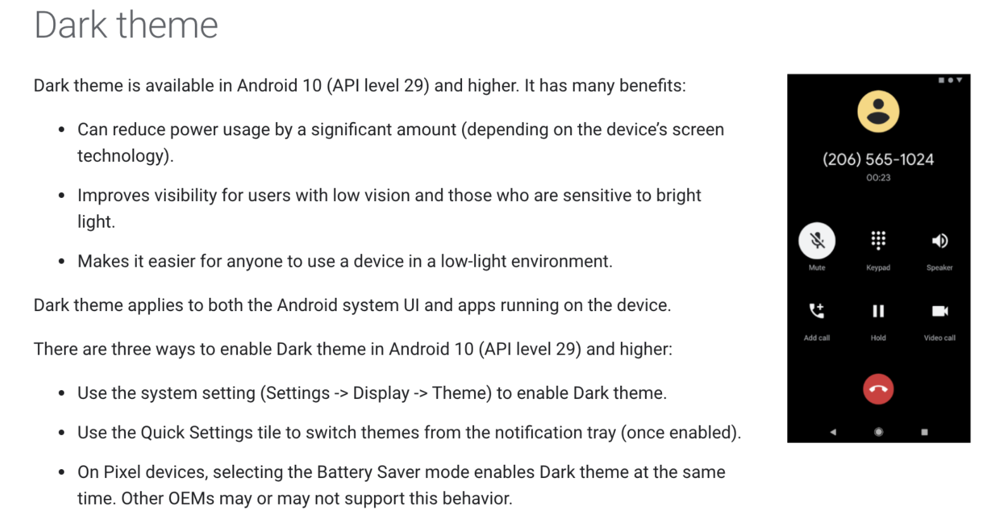
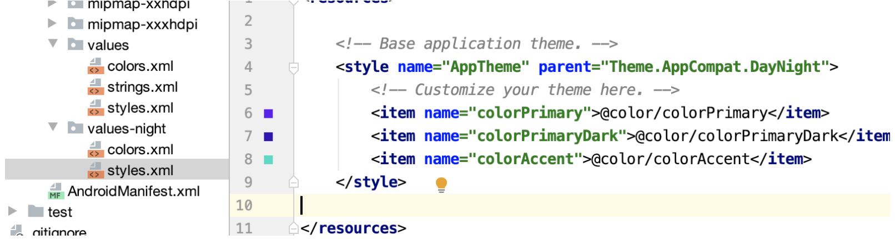
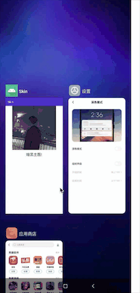
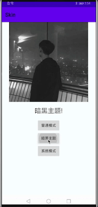

# Skin
安卓暗黑模式适配
## 暗黑模式？安卓适配一波

### 前言

第一次听到暗黑模式的时候，感觉好酷啊，听着就好看（也不知道我怎么听出来的）。苹果在前几年就有暗黑模式的风声，好像是在IOS11、IOS12的时候就说要推出了，结果愣生生等到了IOS13暗黑模式才推出。IOS13推出到现在已经大半年了，系统应用没得说，完美适配，三方应用也都陆续支持了暗黑模式，就连微信在前段时间的更新中也实现了暗黑模式，先来欣赏下微信的暗黑模式吧！



### 正文

既然苹果实现了暗黑模式，那么安卓肯定不能落下啊，所以在安卓10（Q API级别29）中支持了暗黑模式，不过官方的叫法为Dark theme，怎么翻译都行,先来看一下官方对暗黑模式的定义吧：



这里就不一行行翻译了，主要来说一下暗黑模式的好处吧：

- 手机的屏幕目前大部分都已经升级成了OLED屏幕（当然还有一部分手机还是LCD屏幕），OLED屏幕显示黑色的时候不会发光，可以大大减小功耗。
- 提高了弱视用户和对强光敏感的用户的可见性。
- 使任何人在昏暗的环境中都更容易使用设备。

怎样开启暗黑模式就不多说了，手机厂商不同，开启方式不同，各大手机厂商魔改的系统有时候真的找不到在哪设置，那就百度一下吧。

### 设置暗黑主题

为了支持Dark主题，必须将应用的主题设置为继承自`DayNight`主题（res/values/styles.xml）：

```xml
<style name="AppTheme" parent="Theme.AppCompat.DayNight">
```

还可以使用 [MaterialComponents的深色主题](https://material.io/develop/android/theming/dark)：

```xml
<style name="AppTheme" parent="Theme.MaterialComponents.DayNight">
```

这会将应用程序的主主题与系统控制的夜间模式标志相关联，并为应用程序提供默认的深色主题（启用时）。当系统的主题切换时，应用也会随之切换主题。

“这就完了？”

“对啊，主题就设置完了。”

“那我如果想要自定义主题呢？”

大家日常开发中肯定会有这种需求，官方定义的主题不完全能满足我们的需求，这时候就需要来自定义主题了，谷歌也为我们想到了这一点。普通模式下咱们不需要动，该怎么写怎么写，然后在res下再新建一个values-night的文件夹，然后把你自定义的放进去，name起成和styles.xml中对应的主题名称就可以了。来看一下吧：



这样设置完就OK了。

“不对啊，这只是主题变了，那我的Activity的背景、字体的颜色、图片等等该怎么办呢？”

“别着急，下面就要说了。”

这里一定要注意，主题和样式应避免在浅色主题下使用硬编码的颜色或图标，应该使用主题属性（首选）或夜间限定的资源。来了解下两个最重要的主题属性吧：

- `?android:attr/textColorPrimary`这是一种通用的文本颜色。浅色主题为近黑色，深色主题为近白。它包含禁用状态。
- `?attr/colorControlNormal`通用图标颜色。它包含禁用状态。

当然肯定不是必须要使用上面官方提供的两个主题属性，想自定义就自定义啊！眼睛尖的可能已经看见了，上面的图片中的values-night中除了放有style.xml外还有colors.xml，对，没错，咱们只要把颜色信息放入到colors.xml中然后根据需求写上两个颜色就好了。

但还是建议使用[Material Design Components](https://material.io/develop/android/)，因为它的[颜色主题系统](https://material.io/develop/android/theming/color/) （例如主题属性`?attr/colorSurface`和`?attr/colorOnSurface`）可以轻松访问合适的颜色。

“大哥，背景颜色和字体颜色我知道怎么改了，图片呢？图片咋办啊！”

“来了来了，猴急猴急的！”

图片设置其实和颜色差不多，也是两套资源，比如你的drawable文件夹下有一张aaa.jpg的图片，你想在暗黑模式下还称另外一张图片，那么你就可以新建一个drawable-night的文件夹，在里面放上你的另外一张图片就行了，注意， 图片名称一定要和drawable中的对应。同理，drawable-xhdpi、drawable-xxhdpi就是再建两个文件夹：drawable-night-xhdpi、drawable-night-xxhdpi，然后放入对应图片就行了。

“什么？你想看一下效果？那好吧，如你所愿，这真的是你，要是别人我都不让他看。。。。”



怎么样，效果还可以吧？

### 应用内修改主题

“我还想自己主动切换，不想随着系统换才换”

“来，你过来，你还想干啥，说，来来来，说吧”

“我就想自己主动设置是否跟随系统切换主题。。。我看好多应用都有这个功能”

哎，既然你发自内心的问了，那我就大发慈悲的告诉你：当然可以哟！

一般来说应用都会有几个选项供你选择，分别是：普通模式、暗黑模式、跟随系统，对吧？

谷歌也给了我们这几个选项，可以直接进行设置：

- Light[`MODE_NIGHT_NO`](https://developer.android.google.cn/reference/androidx/appcompat/app/AppCompatDelegate.html#MODE_NIGHT_NO)
- 黑暗- [`MODE_NIGHT_YES`](https://developer.android.google.cn/reference/androidx/appcompat/app/AppCompatDelegate.html#MODE_NIGHT_YES)
- 由省电模式设定- [`MODE_NIGHT_AUTO_BATTERY`](https://developer.android.google.cn/reference/androidx/appcompat/app/AppCompatDelegate.html#MODE_NIGHT_AUTO_BATTERY)
- 系统预设- [`MODE_NIGHT_FOLLOW_SYSTEM`](https://developer.android.google.cn/reference/androidx/appcompat/app/AppCompatDelegate.html#MODE_NIGHT_FOLLOW_SYSTEM)

咱们刚才所说的就是Light、黑暗和系统预设，省电模式这里就不写， 如果有需求可以进行实验。

切换主题的方法也很简单，直接调用下面方法就行：

```kotlin
AppCompatDelegate.setDefaultNightMode()
```

就一行代码就行了，参数需要传入上面的四种模式之一。

来吧，那就写一下代码吧，按照上面的要求写三个按钮，分别来实现普通模式、暗黑模式和系统模式吧：

```kotlin
   override fun onClick(v: View) {
        when(v.id){
            R.id.btnLight ->{
                setDefaultNightMode(MODE_NIGHT_NO)
            }
            R.id.btnDark ->{
                setDefaultNightMode(MODE_NIGHT_YES)
            }
            R.id.btnDefault ->{
                setDefaultNightMode(MODE_NIGHT_FOLLOW_SYSTEM)
            }
        }
    }
```

这个代码应该不需要解释了，上面解释的已经够多了。来看一下实现效果吧：


### 配置变更

“大哥，我又想了下，如果有的页面正在播放视频，我想要延迟配置更改该怎么办啊？”

“来，你过来小兄弟，逗着大哥玩呢？这一天天的！”

来吧，有需求就得有实现，谷歌大大已经为我们都想好了，应用可以通过声明每个Activity可以处理[`uiMode`](https://developer.android.google.cn/reference/android/content/res/Configuration#uiMode) 配置更改来处理Dark主题本身的实现：

```xml
<activity
    android:name=".MyActivity"
    android:configChanges="uiMode" />
```

当Activity声明它处理配置更改时，[`onConfigurationChanged()`](https://developer.android.google.cn/reference/android/app/Activity#onConfigurationChanged(android.content.res.Configuration))将在主题更改时调用其方法。

要检查当前主题是什么，应用可以运行如下代码：

```kotlin
val currentNightMode = configuration.uiMode and Configuration.UI_MODE_NIGHT_MASK
when (currentNightMode) {
    Configuration.UI_MODE_NIGHT_NO -> {} // 夜间模式未启用，我们正在使用浅色主题
    Configuration.UI_MODE_NIGHT_YES -> {} // 夜间模式启用，我们使用的是深色主题  
}
```

### 总结

文章到这里基本结束了，谷歌用行动告诉我们尽量不要硬编码，出来混都是要还的，硬编码一时爽，一直硬编码一直爽，哈哈哈。喜欢的点赞+关注啊！
